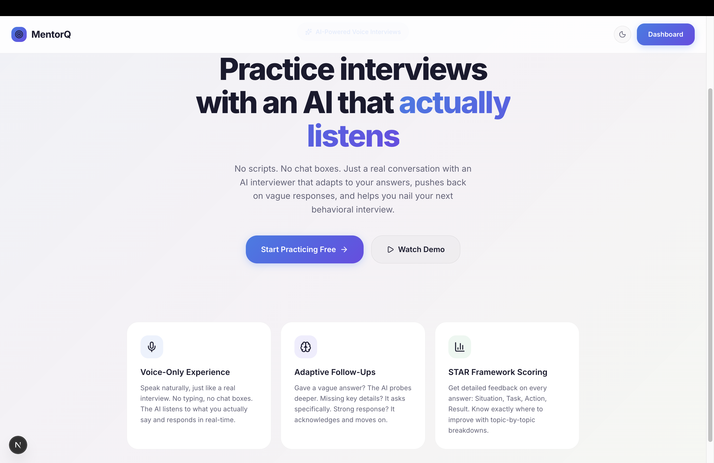
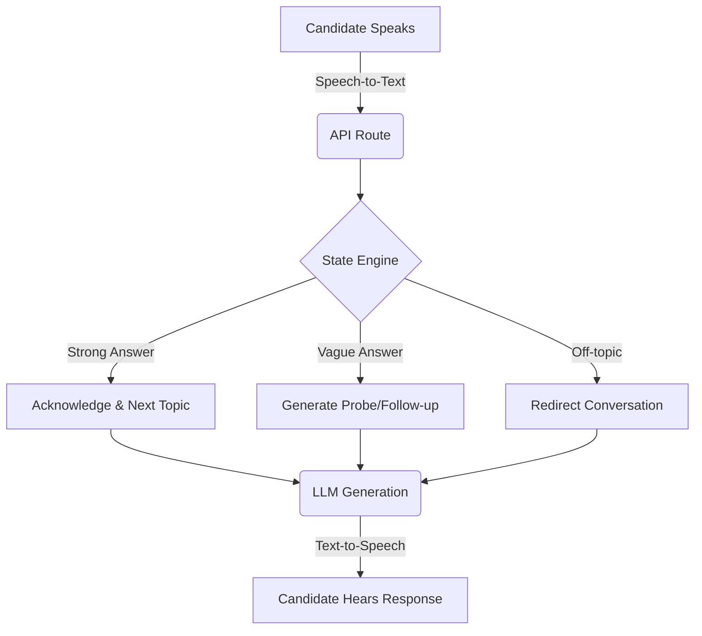

<div align="center">
  
  
  # MentorQ — AI Voice Mock Interview Platform

  **Practice behavioral interviews with an AI that actually listens, adapts, and pushes back.**

  [](https://nextjs.org/)
  [](https://postgresql.org/)
  [](https://www.typescriptlang.org/)
  [](https://tailwindcss.com/)
</div>

---

## 📖 The "Why" (Product Thinking)

Most "AI interviews" on the market today are glorified text chatbots or rigid, scripted questionnaires. They fail to capture the nuances of a real conversation.

**MentorQ is built on a different premise:**
1. **Dynamic, not static:** The AI doesn't read from a hardcoded list. It evaluates your previous answer to determine its next move.
2. **Pushback:** If a candidate gives a vague "STAR" response, the AI will probe deeper ("Can you elaborate on what *specifically* you did in that situation?").
3. **Voice-only constraint:** Real interviews aren't done over text chat. Forcing a voice-only interface builds actual interview muscle memory.

## 🎥 Walkthrough & Demo

*Provide your Loom link here!*

[](https://loom.com/your-link-here)

In the video above, I cover:
1. My approach to the problem and architecture.
2. Key technical trade-offs.
3. A live, end-to-end demonstration of the core voice loop.

---

## 🚀 Quick Start (Local Setup)

Getting the project running locally takes **under 5 commands**:

```bash
# 1. Clone and enter the directory
git clone <your-repo-url> && cd mentorq

# 2. Setup environment variables (add your keys to .env)
cp .env.example .env

# 3. Install dependencies
npm install

# 4. Initialize the database schema
npx prisma db push

# 5. Start the development server
npm run dev
```
*The app will be available at [http://localhost:3000](http://localhost:3000)*

---

## 🏗️ Architecture & Key Decisions

I chose to prioritize **depth and latency** over feature breadth, focusing entirely on making the core conversational loop feel natural.

<div align="center">
  
</div>

### The Interaction Loop
The hardest challenge was ensuring the AI knew *when* to ask a follow-up vs. *when* to move on to a new topic. 



### Technical Trade-offs
- **Voice Stack**: Opted for the browser-native `Web Speech API` (SpeechRecognition & SpeechSynthesis). **Why?** It avoids the heavy latency (and cost) of streaming audio to a backend Whisper model, keeping the interaction loop snappy and realistic.
- **State Machine over LangChain**: Rather than relying on a heavy agent framework, I built a lightweight state machine. **Why?** It provides deterministic control over the interview flow while leaving the actual conversational *content* generation to the LLM.
- **Auth**: Built custom JWT authentication (using `jose`) from scratch. **Why?** It meets the assignment requirement of "simple JWT auth (no OAuth)" without relying on heavy external providers like Clerk or Auth0, showing full-stack capability.

---

## 🔑 Required Environment Variables

| Variable | Description | Cost |
|----------|-------------|------|
| `DATABASE_URL` | Your PostgreSQL connection string (e.g., [Neon](https://neon.tech)) | Free |
| `GROQ_API_KEY` | API key for Groq's ultra-fast LLM inference ([Console](https://console.groq.com)) | Free |
| `JWT_SECRET` | A secure, random 32+ character string for token signing | N/A |

---

## 🛠️ Tech Stack

- **Frontend**: Next.js 16 (App Router), React, Vanilla CSS
- **Backend**: Next.js API Routes (Serverless)
- **Database**: PostgreSQL with Prisma ORM
- **AI / LLM**: Groq (Llama 3) for near-instant inference
- **Voice**: Web Speech API (STT/TTS)
- **Auth**: Custom JWT

---

<div align="center">
  <i>Built as an engineering assignment for MentorQ.</i>
</div>
